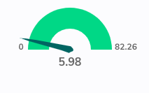

# react-d3-guage

**react-d3-guage** is a react component for showing gauge using d3.

## forked from https://github.com/palerdot/react-d3-speedometer



## Usage:

**NPM:**
`npm install --save react-d3-guage`

**Yarn:**
`yarn add react-d3-guage`

```javascript
// import the component
import ReactGuage from 'react-d3-guage';
// and just use it
<ReactGuage />;
```

## Configuration Options:

| prop                     |  type   |       default | comments                                                                                                                                                                                                                                                                                                                                                                                                                                                                   |
| ------------------------ | :-----: | ------------: | -------------------------------------------------------------------------------------------------------------------------------------------------------------------------------------------------------------------------------------------------------------------------------------------------------------------------------------------------------------------------------------------------------------------------------------------------------------------------- |
| value                    | number  |             0 | Make sure your value is between your `minValue` and `maxValue`                                                                                                                                                                                                                                                                                                                                                                                                             |
| minValue                 | number  |             0 |                                                                                                                                                                                                                                                                                                                                                                                                                                                                            |
| maxValue                 | number  |          1000 |                                                                                                                                                                                                                                                                                                                                                                                                                                                                            |
| segments                 | number  |             5 | Number of segments in the guage                                                                                                                                                                                                                                                                                                                                                                                                                                            |
| forceRender              | boolean |         false | After initial rendering/mounting, when props change, only the `value` is changed and animated to maintain smooth visualization. But, if you want to force rerender the whole component like change in segments, colors, dimensions etc, you can use this option to force rerender of the whole component on props change.                                                                                                                                                  |
| width                    | number  |           300 | **diameter** of the guage and the **width** of the svg element                                                                                                                                                                                                                                                                                                                                                                                                             |
| height                   | number  |           300 | height of the svg element. Height of the guage is always half the width since it is a **semi-circle**. For fluid width, please refere to `fluidWidth` config                                                                                                                                                                                                                                                                                                               |
| needleColor              | string  |     steelblue | Should be a valid color code - colorname, hexadecimal name or rgb value. Should be a valid input for [d3.interpolateHsl](https://github.com/d3/d3-interpolate#interpolateHsl)                                                                                                                                                                                                                                                                                              |
| startColor               | string  |       #FF471A | Should be a valid color code - colorname, hexadecimal name or rgb value. Should be a valid input for [d3.interpolateHsl](https://github.com/d3/d3-interpolate#interpolateHsl)                                                                                                                                                                                                                                                                                              |
| endColor                 | string  |       #33CC33 | Should be a valid color code - colorname, hexadecimal name or rgb value. Should be a valid input for [d3.interpolateHsl](https://github.com/d3/d3-interpolate#interpolateHsl)                                                                                                                                                                                                                                                                                              |
| needleTransition         | string  | easeQuadInOut | [d3-easing-identifiers](https://github.com/d3/d3-ease) - easeLinear, easeQuadIn, easeQuadOut, easeQuadInOut, easeCubicIn, easeCubicOut, easeCubicInOut, easePolyIn, easePolyOut, easePolyInOut, easeSinIn, easeSinOut, easeSinInOut, easeExpIn, easeExpOut, easeExpInOut, easeCircleIn, easeCircleOut, easeCircleInOut, easeBounceIn, easeBounceOut, easeBounceInOut, easeBackIn, easeBackOut, easeBackInOut, easeElasticIn, easeElasticOut, easeElasticInOut, easeElastic |
| needleTransitionDuration | number  |           500 | Time in milliseconds.                                                                                                                                                                                                                                                                                                                                                                                                                                                      |
| ringWidth                | number  |            60 | Width of the guage ring.                                                                                                                                                                                                                                                                                                                                                                                                                                                   |
| textColor                | string  |          #666 | Should be a valid color code - colorname, hexadecimal name or rgb value. Used for both showing the current value and the segment values                                                                                                                                                                                                                                                                                                                                    |
| valueFormat              | string  |               | should be a valid format for [d3-format](https://github.com/d3/d3-format#locale_format). By default, no formatter is used. You can use a valid d3 format identifier (for eg: `d` to convert float to integers), to format the values. **Note:** This formatter affects all the values (current value, segment values) displayed in the guage                                                                                                                               |

## Examples

```javascript
<ReactGuage />
```

```javascript
<ReactGuage
  maxValue={500}
  value={473}
  needleColor="red"
  startColor="green"
  segments={10}
  endColor="blue"
/>
```

```javascript
// guage will take the width of the parent div (500)
// any width passed will be ignored
<div
  style={{
    width: '500px',
    height: '300px',
    background: '#EFEFEF'
  }}
>
  <ReactGuage
    fluidWidth={true}
    minValue={100}
    maxValue={500}
    value={473}
    needleColor="steelblue"
  />
</div>
```

```javascript
<ReactGuage
  value={333}
  needleColor="steelblue"
  needleTransitionDuration={4000}
  needleTransition="easeElastic"
/>
```

_This is the needle transition used in the sample image_

```javascript
// By default, when props change, only the value prop is updated and animated.
// This is to maintain smooth visualization and to ignore breaking appearance changes like segments, colors etc.
// You can override this behaviour by giving forceRender: true

// render a component initially
<ReactGuage
  width={200}
  height={200}
/>
// Now, if given forceRender: true, and change the appearance all together, the component will rerender completely on props change
<ReactGuage
  forceRender={true}
  segments={15}
  width={500}
  height={500}
/>
```

---

### Todos:

- [x] Test coverage (with enzyme)
- [ ] Convert entire code base to ES6

---

### Tests:

`react-d3-guage` comes with a test suite using [enzyme](https://github.com/airbnb/enzyme).

```javascript
// navigate to root folder and run
npm test
// or 'yarn test' if you are using yarn
```

---

#### Changelog:

[View Changelog](CHANGELOG.md)

---

#### Credits:

`react-d3-guage` was started as a react port of the following d3 snippet - [http://bl.ocks.org/msqr/3202712](http://bl.ocks.org/msqr/3202712). Component template bootstrapped with [React CDK](https://github.com/storybooks/react-cdk). Also, many thanks to `d3` and `react` ecosystem contributors.

---

#### License:

[MIT](LICENSE)
